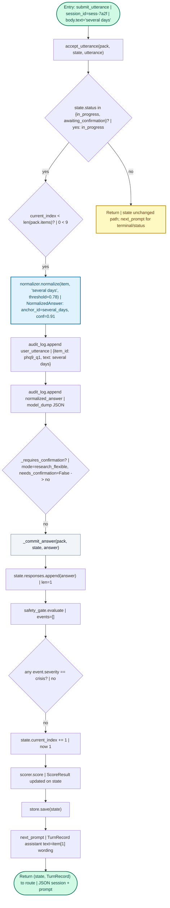
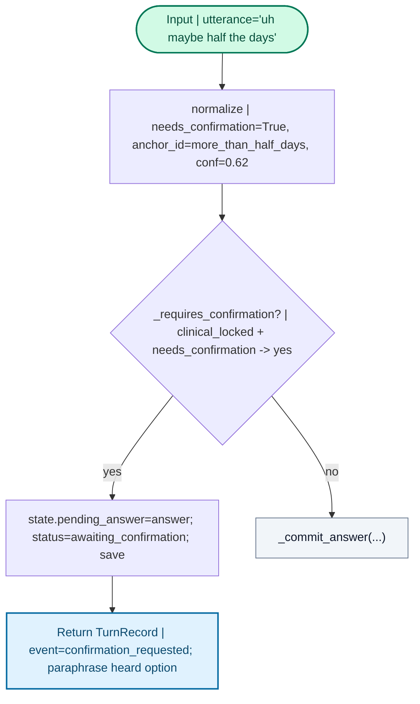

# `accept_utterance` — dry run and control-flow map

**TL;DR**

- **`accept_utterance`** is the core “user said something — advance the assessment” step: normalize text for the **current** question, log it, then either ask for **confirmation** or **commit** the answer (safety, scoring, next prompt).
- It matters because every user turn in voice or text mode funnels through here; the HTTP API exposes it as `POST /sessions/{session_id}/utterance`.

**Mental model**

- Like a **cashier ringing one line item**: they hear what you want (`utterance`), match it to a **SKU** (`NormalizedAnswer`), optionally **double-check** unclear items (`awaiting_confirmation`), then **update the receipt** (`responses`, `score`) and ask for the **next** item (`next_prompt`).

**Job of this piece**

- **Owns:** branching on session status, invoking normalization, writing audit events, deciding confirm vs commit, persisting `SessionState`.
- **Does not own:** how strings map to anchors (that is **`DeterministicNormalizer.normalize`**), crisis rules (**`SafetyGate.evaluate`**), or export path selection (**`JsonExporter`** inside **`_commit_answer`**).

---

## Call context (repo)

- **Entry:** FastAPI `submit_utterance` in `shrutilens/api/app.py` (handles `UtteranceRequest.text`).
- **Hot caller:** same route — **one HTTP POST** → **one** `AssessmentRunner.accept_utterance`.
- **Callee under review:** `AssessmentRunner.accept_utterance` and (on commit) `AssessmentRunner._commit_answer` in `shrutilens/core/runner.py`.

```text
%% Hot path: submit_utterance -> accept_utterance -> [normalize] -> _commit_answer or confirmation TurnRecord
```

---

## Happy path dry run

**Assumptions (dummy trace):**

- `pack_id`: `demo_phq9`, `mode`: `research_flexible` (so low-confidence confirmation rules are relaxed vs `clinical_locked`).
- `policy.confirmation_required`: `low_confidence` (default in `PackPolicy`).
- `SessionState`: `id="sess-7a2f"`, `status=in_progress`, `current_index=0`, `responses=[]`, `pending_answer=None`.
- Current item: `item_id="phq9_q1"`, `text="Over the last 2 weeks, how often have you had little interest or pleasure?"`
- User utterance: `"several days"` (maps cleanly to an anchor).
- **Normalizer output** (illustrative): `NormalizedAnswer(item_id="phq9_q1", raw_text="several days", anchor_id="several_days", value=1, confidence=0.91, needs_confirmation=False, source="deterministic")`.
- **Safety:** no hook fires with severity `crisis`.
- After commit: `current_index=1`; next assistant turn is for item 2 (intro omitted in labels for space).



**Decode (5 bullets):**

1. **Gate 1:** If the session is not actively taking answers, the method **does not** interpret `utterance` as a new response; you get whatever **`next_prompt`** returns for that status (e.g. already complete).
2. **Gate 2:** If `current_index` is already past the last item, it marks **completed** and returns the closing turn.
3. **Normalize:** The **current** `pack.items[current_index]` defines what `"several days"` means (anchor, score, confidence).
4. **Confirm vs commit:** `_requires_confirmation` depends on `pack.policy.confirmation_required`, **`pack.mode`**, and `answer.needs_confirmation` — happy path skips straight to **`_commit_answer`**.
5. **`_commit_answer`:** Appends response, runs **safety**, may **interrupt** on crisis; otherwise bumps index, recomputes **score**, saves, and returns the **next** question via **`next_prompt`**.

---

## Edge cases and branches

**Assumptions:** same session, but **clinical_locked** mode and fuzzy text so `needs_confirmation=True`, and `confirmation_required=low_confidence`.



**Other branches (numbered, no extra diagram):**

1. **Crisis safety:** In `_commit_answer`, if any **`SafetyEvent.severity == "crisis"`**, `state.status` becomes **`safety_interrupted`**, score is computed, save, return — subsequent **`next_prompt`** yields the safety protocol message (not the next survey item).
2. **Last item:** When `current_index` reaches `len(pack.items)` after increment, `status` becomes **`completed`**, exporter runs, audit gets `session_completed`.
3. **Repair loop:** If user was awaiting confirmation and denies, **`confirm_pending`** (not `accept_utterance`) may call **`accept_utterance` again** with `corrected_text` — second entry point into the same normalize path.

---

## Why it is built this way

- **Single funnel** for user text keeps audit, normalization, and state machine ordering consistent.
- **Confirmation** is a separate **`SessionStatus`** so the API can expose `/confirmation` without overloading `utterance` with hidden state.
- **Safety after normalize** means rules run on **structured** evidence (`NormalizedAnswer`, hooks), not only raw strings.

---

## Mini recap

| | |
|--|--|
| **Wins** | Clear split: normalize -> confirm? -> commit; full audit trail on utterance + normalized answer. |
| **Risks** | Caller must respect **`awaiting_confirmation`** (only posting more `utterance` without confirming can leave UX inconsistent unless you treat utterance as “correction” by design). |
| **Open next** | `shrutilens/core/normalizer.py` (mapping), `shrutilens/core/safety.py` (hooks), `confirm_pending` in `runner.py` for the other half of the dialog loop. |
| **Primary caller** | `submit_utterance` in `shrutilens/api/app.py` |

> **Legend:** Green = HTTP/API entry and successful exit handoff. Blue = I/O-heavy or side effects (normalize, prompts). Yellow = alternate early return. Diamonds = runtime decisions.
